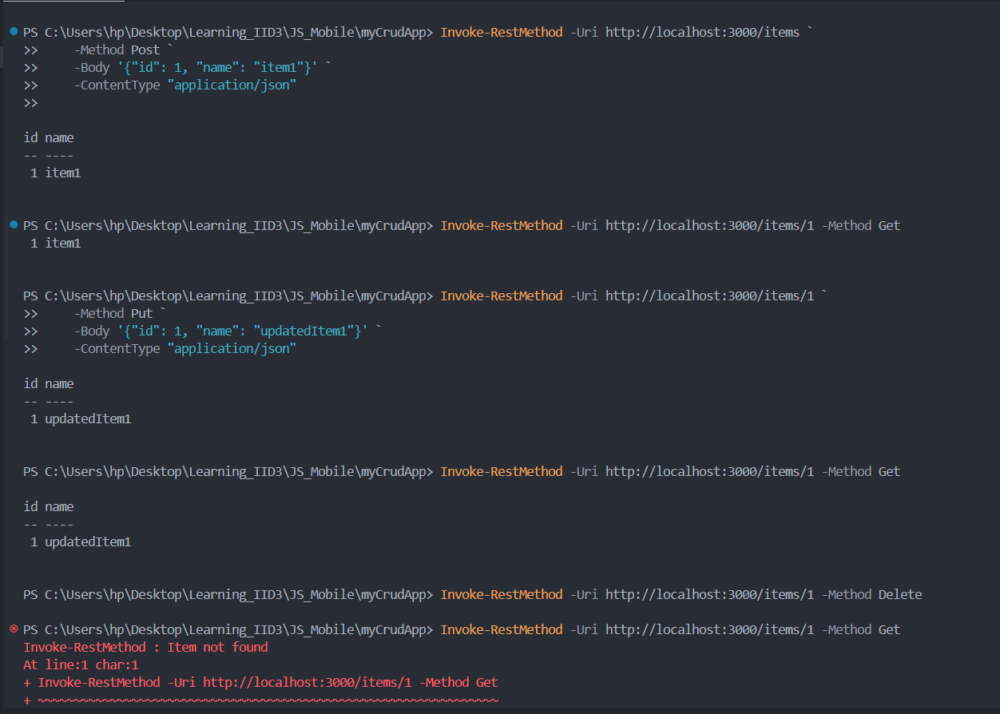

# 1. What is Express.js?

**Express.js** is a web application framework for Node.js, designed for building web applications and APIs. It simplifies the process of handling HTTP requests, responses, and routing, offering a minimal but flexible set of features.

### Use cases of Express.js:

- Developing web applications (both frontend and backend).
- Building APIs.
- Real-time web applications (e.g., chat apps).

# 2. What are middlewares and how are they used in Express.js?

**Middlewares** are functions in Express.js that have access to the request (`req`), response (`res`), and the next function in the request-response cycle. They are used to modify the request or response objects, end the request-response cycle, or call the next middleware in the stack.

# Test the Endpoints using Postman

